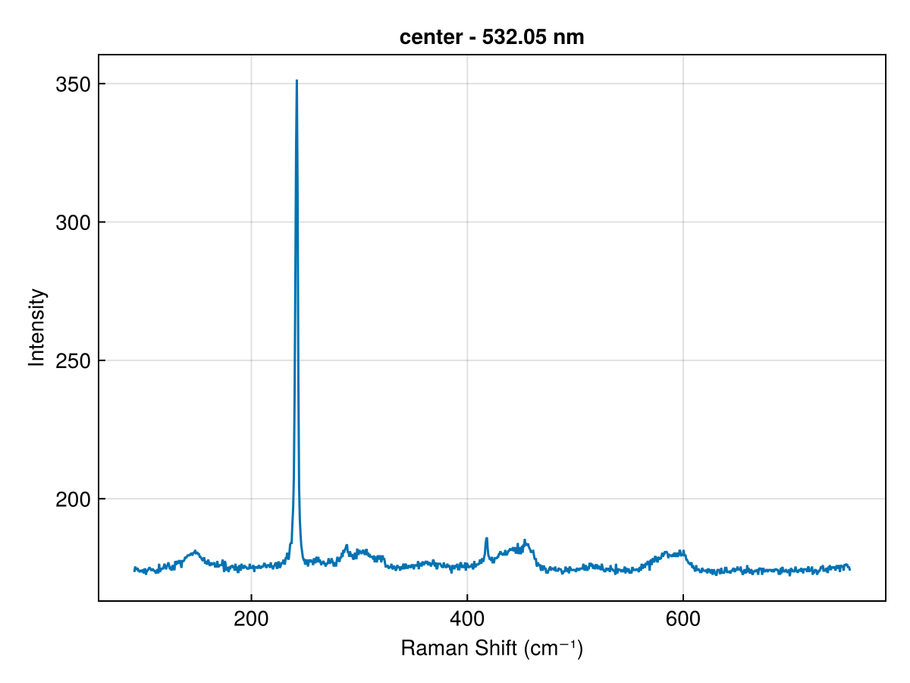
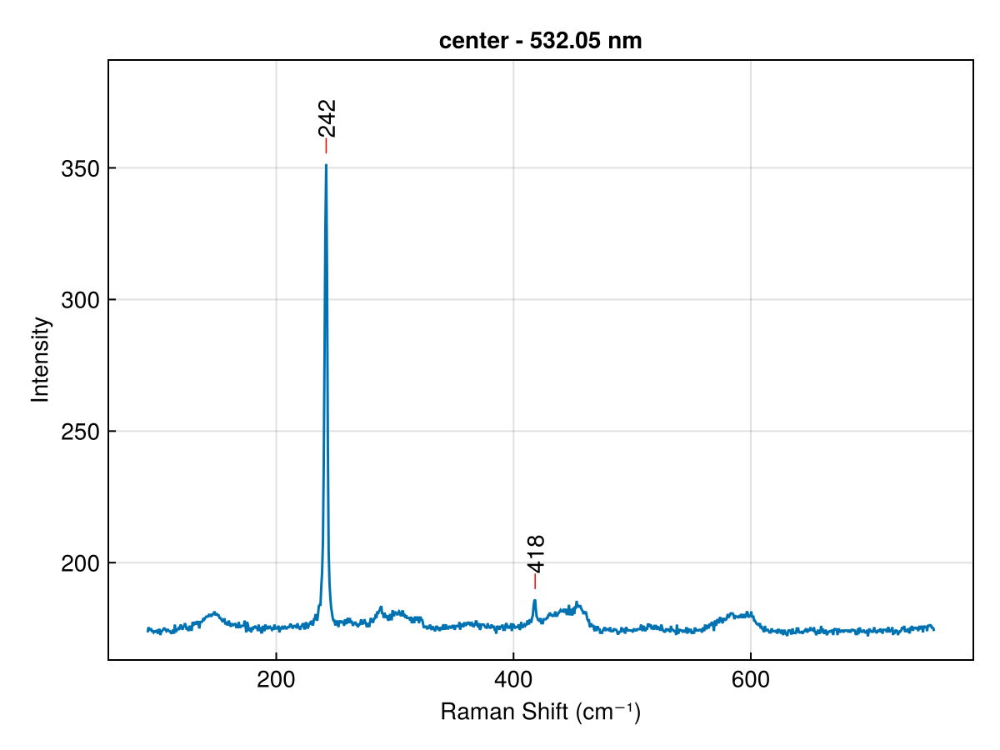
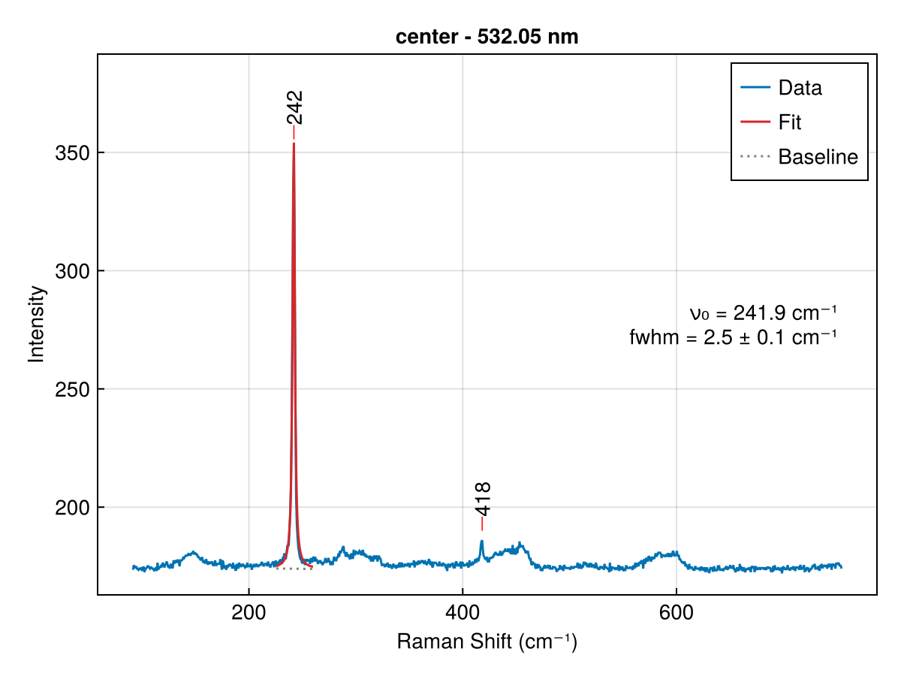
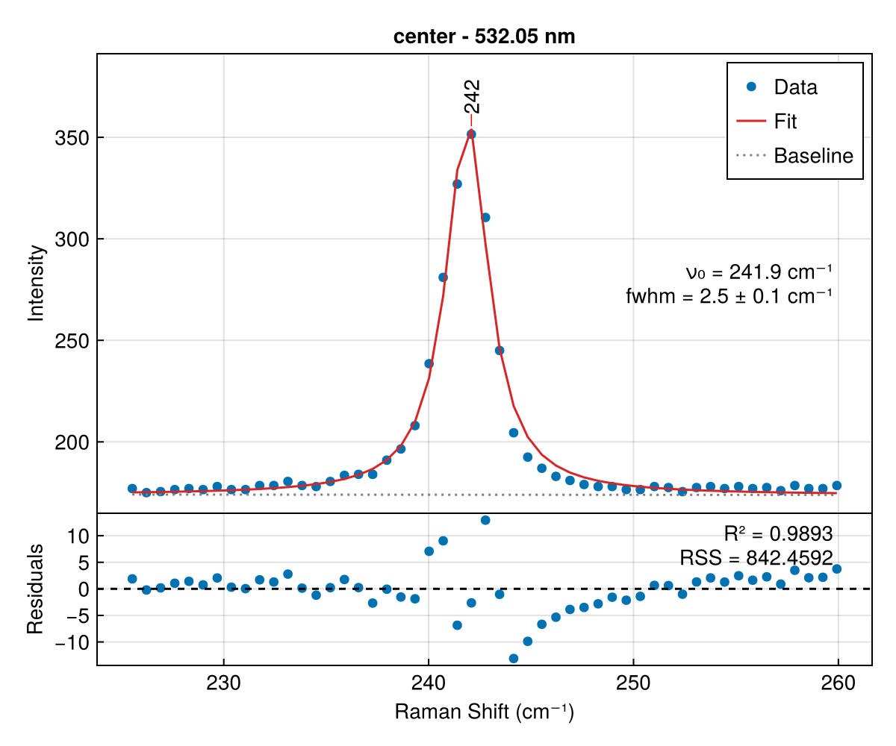
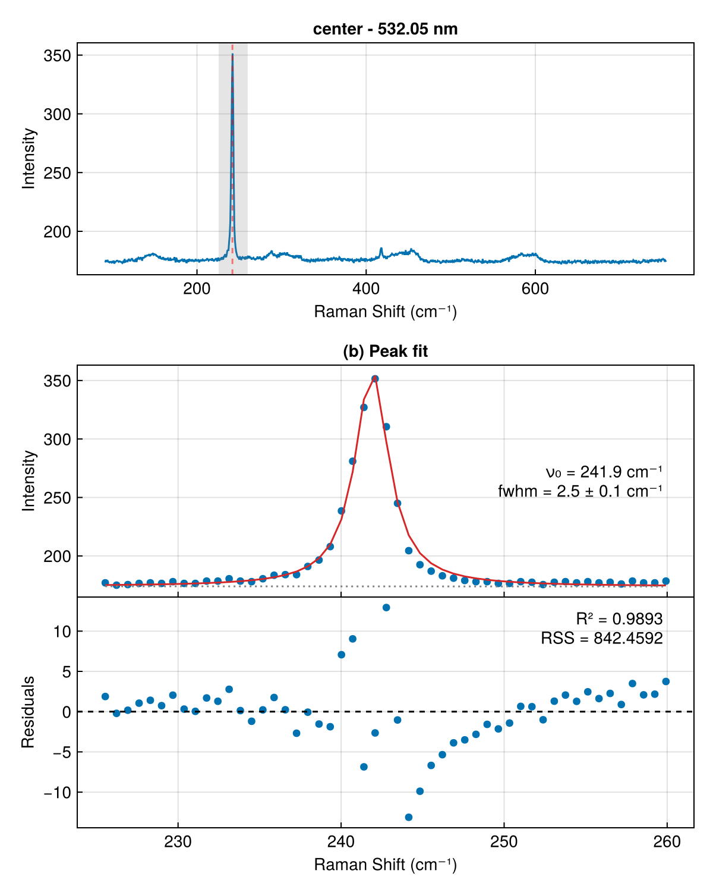
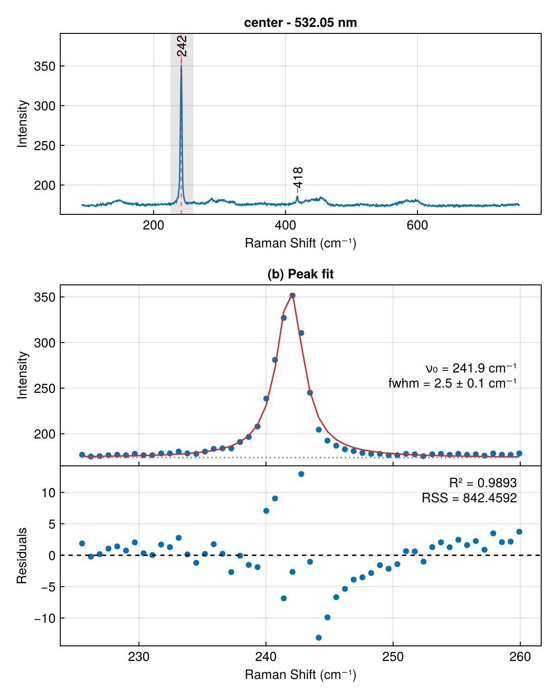

# Spectrum Plotting

`plot_spectrum` is the unified plotting function for all spectrum types.
It uses keyword arguments to select between different layouts, from a simple survey view to a three-panel publication figure.

Convenience aliases `plot_ftir`, `plot_raman`, and `plot_cavity` forward all keyword arguments to `plot_spectrum`.

## Quick Reference

The three keyword arguments that control layout are `peaks`, `fit`, and `residuals` (plus `context` for `AnnotatedSpectrum` types):

| kwargs | Layout | Returns |
|--------|--------|---------|
| (none) | Survey | `(Figure, Axis)` |
| `peaks` | Full spectrum + peak markers | `(Figure, Axis)` |
| `fit` | Zoomed to fit region | `(Figure, Axis)` |
| `fit + peaks` | Full spectrum with fit overlaid | `(Figure, Axis)` |
| `fit + residuals` | Stacked: fit region + residuals | `(Figure, Axis, Axis)` |
| `fit + peaks + residuals` | Stacked, peaks filtered to fit region | `(Figure, Axis, Axis)` |
| `fit + context` | Three-panel: full, fit, residuals | `(Figure, Axis, Axis, Axis)` |
| `fit + context + peaks` | Three-panel, peaks on context panel | `(Figure, Axis, Axis, Axis)` |

## Walkthrough

All examples below use the same data:

```julia
using QPSTools
using CairoMakie

spec = load_raman(sample="center", material="MoSe2")
peaks = find_peaks(spec)
fit = fit_peaks(spec, (225, 260))
```

### 1. Survey

The simplest call. Plots the full spectrum as a line.

```julia
fig, ax = plot_raman(spec)
```



### 2. Peaks

Pass pre-computed peaks from `find_peaks`. Markers and position labels are drawn at each peak.

```julia
fig, ax = plot_raman(spec; peaks=peaks)
```



### 3. Fit

When only `fit` is provided, the view zooms to the fit region and shows the data as scatter points with the fit curve and peak decomposition overlaid.

```julia
fig, ax = plot_raman(spec; fit=fit)
```


### 4. Fit + Peaks

Adding `peaks` with a `fit` switches to a full-spectrum view.
The fit curve is overlaid in its region, and all peak markers are shown at full scale.
This is useful for seeing where the fitted peak sits relative to the rest of the spectrum.

```julia
fig, ax = plot_raman(spec; fit=fit, peaks=peaks)
```



### 5. Fit + Residuals

A stacked two-panel layout: fit region on top, residuals below.
Check that residuals scatter randomly around zero with no systematic pattern.

```julia
fig, ax, ax_res = plot_raman(spec; fit=fit, residuals=true)
```


### 6. Fit + Peaks + Residuals

Same stacked layout, with peaks filtered to the fit region.

```julia
fig, ax, ax_res = plot_raman(spec; fit=fit, peaks=peaks, residuals=true)
```



### 7. Context (Three-Panel)

A publication-ready three-panel layout:

- **(a)** Full spectrum with the fit region shaded
- **(b)** Zoomed fit region with scatter data, fit curve, and decomposition
- **(c)** Residuals

```julia
fig, ax_ctx, ax_fit, ax_res = plot_raman(spec; fit=fit, context=true)
```



### 8. Context + Peaks

Same three-panel layout, with peak markers drawn on the context panel (a).

```julia
fig, ax_ctx, ax_fit, ax_res = plot_raman(spec; fit=fit, context=true, peaks=peaks)
```



## Keyword Precedence

When multiple keywords are combined, the layout is selected by priority:

1. `fit + context` always produces the three-panel layout
2. `fit + residuals` produces the stacked layout (even if `peaks` is also provided)
3. `fit + peaks` (without `residuals`) produces the full-spectrum overview
4. `fit` alone zooms to the fit region
5. No `fit` shows the full spectrum

## Warnings

Invalid combinations produce a warning and fall back gracefully:

- `residuals=true` without `fit` — warns and returns a survey view
- `context=true` without `fit` — warns and returns a survey view

## Dispatch Methods

`plot_spectrum` dispatches on the first argument:

| Dispatch | Axis labels | x-reversed | Scatter in fit view |
|----------|-------------|------------|---------------------|
| `(x::AbstractVector, y::AbstractVector)` | Manual | No | No |
| `(spec::AnnotatedSpectrum)` | Auto from type | Auto (e.g. FTIR) | Yes |
| `(spec::TASpectrum)` | Wavenumber / ΔA | No | No |

For `AnnotatedSpectrum` types (FTIR, Raman, Cavity), the `context` keyword accepts a `Bool` and the full spectrum data is provided automatically.
For raw vectors, `context` accepts a tuple `(full_x, full_y)` or `(full_x, full_y, region)`.

## Layer Functions

For custom figures, the public layer functions draw on an existing `Axis`:

- `plot_peaks!(ax, peaks)` — Add peak markers and labels
- `plot_peak_decomposition!(ax, result)` — Overlay individual peak curves, baseline, and composite fit

```julia
fig = Figure()
ax = Axis(fig[1, 1], xlabel="Raman Shift (cm⁻¹)", ylabel="Intensity")
lines!(ax, xdata(spec), ydata(spec))
plot_peaks!(ax, peaks)
save("custom_figure.pdf", fig)
```

## Related

- [Peak Detection](@ref "Peak Detection") — `find_peaks` reference
- [Peak Fitting](@ref "Peak Fitting") — `fit_peaks` and result types
- [Tutorial: Raman Analysis](@ref "Tutorial: Raman Spectroscopy Analysis") — full workflow
